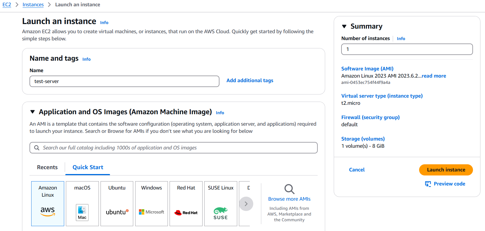
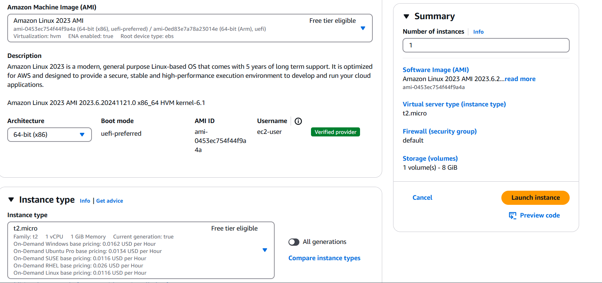
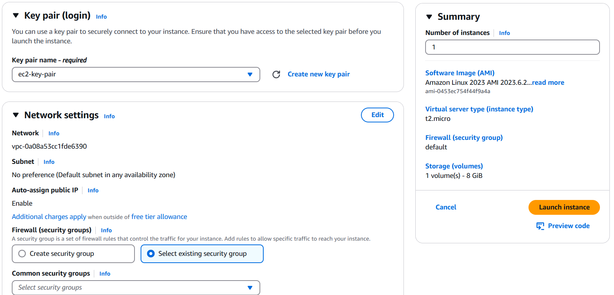
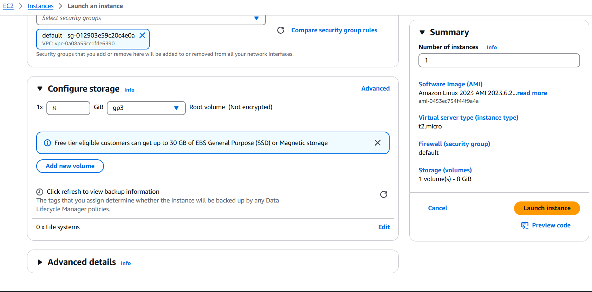

# AWS Fundamentals

## Table of Contents

1. [AWS Infrastructure](#1-aws-infrastructure-overview)  
2. [AWS EC2](#2-ec2-elastic-cloud-compute)  
3. [AWS CLI Overview](#3-aws-cli-overview)  
4. [Launching an EC2 Instance](#4-launching-an-ec2-instance-via-aws-console)  

---

## 1. AWS Infrastructure Overview

### Key Components of AWS Infrastructure

1. **Regions**  
   - Geographic locations such as US East, US West, etc.  
   - Each region consists of multiple **Availability Zones (AZs)** (at least 2).  

2. **Availability Zones (AZs)**  
   - Isolated physical locations within a region, designed to be failure-independent.  

3. **Edge Locations**  
   - Mini data centers that serve multiple AZs.  
   - Enhance performance using AWS CDN (Content Delivery Network).  

---

### Useful Links
- [AWS Global Infrastructure Overview](https://aws.amazon.com/about-aws/global-infrastructure/)  
- [AWS Regions and Availability Zones](https://aws.amazon.com/about-aws/global-infrastructure/regions_az/)  

---

### Why Learn About AWS Infrastructure?

- Enables building **highly available** applications with **minimum latency**.  
- Example: Hosting resources in Indian regions ensures **low latency** for Indian users.  

---

### Points to Remember

1. Resources do not replicate across regions unless configured.  
   Example: A resource in `us-east-1` will not be available in `us-east-2` unless replicated manually.  

---

## 2. EC2 (Elastic Cloud Compute)

### Overview

1. **Purpose**: Provides virtual servers for computing in the cloud.  
2. **Location**: Instances are hosted in Availability Zones (AZs).  
3. **Physical Nature**: EC2 is not serverless; it uses physical servers in data centers.

---

### Key Components of EC2

1. **Instances**: Virtual servers for running applications, optimized for compute, memory, or storage.  
2. **AMIs (Amazon Machine Images)**: Pre-configured OS and software templates for instances.  
3. **Instance Types**: Define compute, memory, and storage resources (e.g., General Purpose, Compute Optimized).  
4. **EBS (Elastic Block Store)**: Scalable block storage for persistent data.  
5. **Security Groups**: Virtual firewalls for controlling traffic.  
6. **Key Pairs**: Used for secure SSH access.  
7. **Elastic IPs**: Static public IPs for consistent internet access.  
8. **Load Balancers**: Distribute traffic across instances for high availability.  
9. **Auto Scaling**: Dynamically adjusts the number of instances based on demand.  
10. **Tags**: Metadata for organizing and identifying resources.  

---

## 3. AWS CLI Overview

The **AWS Command Line Interface (CLI)** lets you manage AWS services from your terminal, enabling automation and script-based workflows.

---

### Setting Up an IAM User with Admin Access for CLI

1. **Create an IAM User**  
   - Go to the [IAM Console](https://console.aws.amazon.com/iam/).  
   - Create a user with **Programmatic Access** enabled.  
   - Attach the **AdministratorAccess** policy.

2. **Download Access Credentials**  
   - Save the **Access Key ID** and **Secret Access Key** securely.

3. **Install AWS CLI**  
   - Download and install from the [official site](https://aws.amazon.com/cli/).

4. **Configure AWS CLI**  
   - Run `aws configure` and provide:  
     - **Access Key ID**  
     - **Secret Access Key**  
     - **Default region** (e.g., `us-east-1`)  
     - **Output format** (e.g., `json`)  

5. **Verify Configuration**  
   - Test setup with a command like `aws s3 ls`.

---

### Notes
- Use **AdministratorAccess** only for trusted users.  
- Enable **MFA (Multi-Factor Authentication)** for added security.  

---

## 4. Launching an EC2 Instance via AWS Console

### Steps

1. **Log in to AWS Console**  
   - Visit the [AWS Management Console](https://aws.amazon.com/console/) and sign in.

2. **Navigate to EC2**  
   - Search for **EC2** in the services menu and select it.

3. **Launch Instance**  
   - Click **Launch Instances** on the EC2 dashboard.

4. **Choose an AMI**  
   - Select an **Amazon Machine Image (AMI)** (e.g., Amazon Linux or Ubuntu).  

5. **Select Instance Type**  
   - Pick an instance type, such as `t2.micro` (free tier eligible).  

6. **Configure Instance Details**  
   - Specify:
     - VPC and Subnet
     - Enable Auto-Assign Public IP (if needed).  

7. **Add Storage**  
   - Configure storage (e.g., 8GB EBS for the root volume).  

8. **Add Tags**  
   - Add metadata to identify the instance (e.g., `Key: Name`, `Value: MyInstance`).  

9. **Configure Security Group**  
   - Define inbound and outbound rules (e.g., allow SSH on port 22).  

10. **Review and Launch**  
    - Verify configurations and click **Launch**.  
    - Select or create a key pair for SSH access.

11. **Access Instance**  
    - Use the instance's public IP to connect via SSH:  
      ```bash
      ssh -i keypair.pem ec2-user@<Public-IP>
      ```

---

### Example Screenshots

1. **Launch EC2 Instance**  
   

2. **Select AMI**  
   

3. **Key Pair and Security Group**  
   

4. **Network and Storage Settings**  
     

*Source: AWS Documentation*
